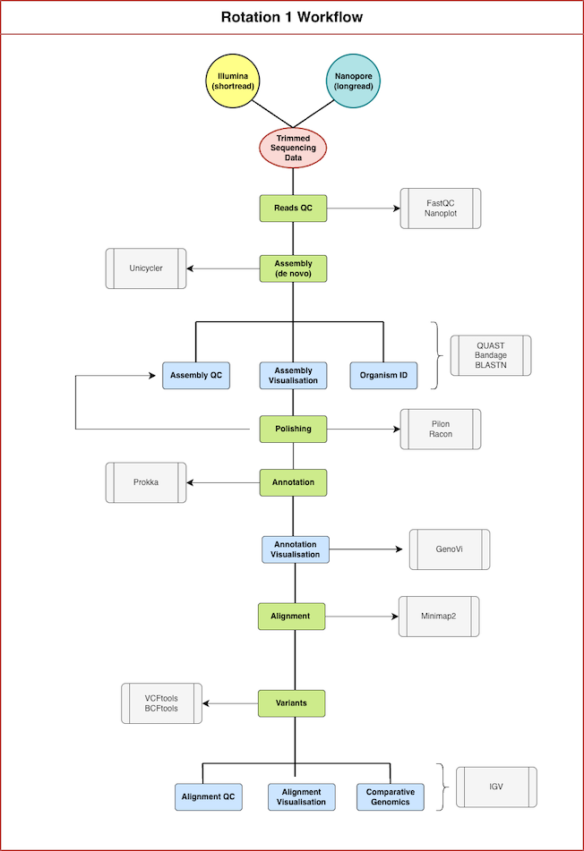
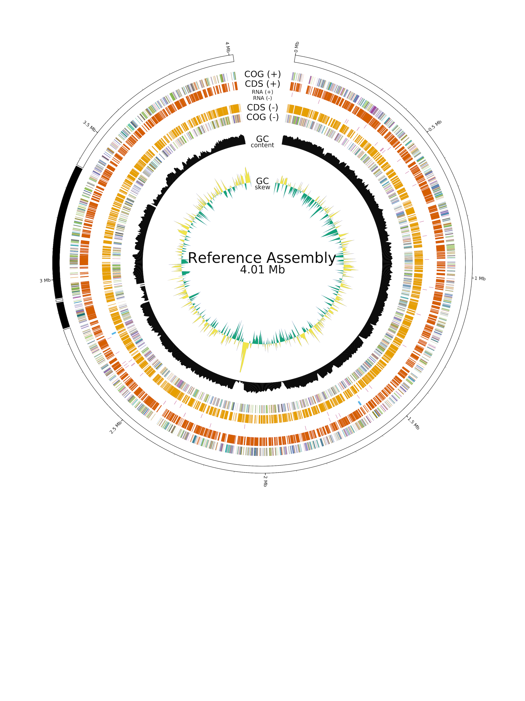

# LIFE4136 – Rotation 1 – Group 4 - 2025/26

This repository contains the scripts, methods and software used to produce the results for Rotation 1 – Group 4 of the LIFE4136 Bioinformatics module at the University of Nottingham for the 2025/2026 cohort. The samples analysed were `sample1` and `sample4`.

Table of Contents
=================

   * [Introduction](#introduction)
      * [Reference Genome](#reference-genome)
      * [Project Tree](#project-tree)
      * [Overview of Workflow](#overview-of-workflow)
   * [Installation](#installation)
      * [Getting the repository](#getting-the-repository)
      * [List of software](#list-of-software)
      * [Environments](#environments)
      * [Installing Conda](#installing-conda)
      * [Setting up Environments](#setting-up-the-environments)
   * [Usage](#usage)
      * [Input Data](#input-data)
      * [Executing Scripts](#executing-scripts)
   * [List of Scripts](#list-of-scripts)
   * [Methods](#methods)
      * [Pipeline](#pipeline-analysis)
      * [1. Preprocessing](#1-preprocessing)
      * [2. Reads quality control (QC)](#2-reads-quality-control-qc)
      * [3. Identify sample origin](#3-identify-sample-origin)
      * [4. Genome assembly](#4-genome-assembly)
      * [5. Polish genome assemblies](#5-polish-genome-assemblies)
      * [6. Genome assembly QC](#6-genome-assembly-qc)
      * [7. Genome assembly annotation](#7-genome-assembly-annotation)
      * [8. Genome assembly alignment to reference genome](#8-genome-assembly-alignment-to-reference-genome)
      * [9. Variant analysis](#9-variant-analysis)
   * [Troubleshooting](#troubleshooting)
   * [Software Citations](#software-citations)


   


## Introduction
Raw short read (Illumina) and long read (Nanopore) genomic sequencing data were provided from two samples – `sample1` and `sample4` – of an unknown strain of microorganism where unknown genetic changes had been induced. 

This project aimed to address the following for each sample analysed:
1. Establish optimal de novo assembly
2. Determine topology and quantity of chromosomes
3. Identify genomic changes 
4. Identify genetic variation against a reference genome
5. Infer functional effects of the gene editing

To address these aims, short read, long read and hybrid (short and long read) de novo genomes were constructed from the raw read data and then polished. Polished assemblies were annotated then aligned to a reference genome to identify variants. Quality control on raw reads and de novo genome assemblies was performed throughout the analysis to determine the optimal assembly. Assembly and alignment visualisers were used to observe regions of genomic structures and variation, and identify genomic features for research to infer functional effects.

### Reference Genome
Sample origin for `sample1` and `sample4` was identifed as Haloferax *volcanii* DS2 therefore the reference genome shown below was used for this analysis:

| Organism | Haloferax *volcanii* DS2 |
|----------|----------|
| **Assembly**  | ASM2568v1 |
| **Accession** | GCF_000025685.1 |
| **Source** | NCBI RefSeq / FTP |
| **Completeness** | Complete Genome |
| **Composition** |Chromosome + plasmids |
| **Downloaded** | 2026-02-15 |

### Project Tree
The project tree `project_tree.txt` displays the appearance of the directory structure following successful completion of all analysis steps. Click [here](project_tree.txt) to view tree.

### Overview of workflow


## Installation
### Getting the repository
A local repository can be made by cloning the GitHub URL (https://github.com/CJ770411/L4136_Rotation1_Group4_25-26):

```
git clone https://github.com/CJ770411/L4136_Rotation1_Group4_25-26.git
```

### List of software
- [Conda](https://github.com/conda/conda) (v25.7.0)
- [FastQC](https://github.com/s-andrews/FastQC) (v0.12.1)
- [NanoPlot](https://github.com/wdecoster/NanoPlot) (v1.46.2)
- [Unicycler](https://github.com/rrwick/Unicycler) (v0.5.1)
- [Racon](https://github.com/lbcb-sci/racon) (v1.5.0)
- [Pilon](https://github.com/broadinstitute/pilon) (v1.24)
- [Picard](https://github.com/broadinstitute/picard) (v2.20.4)
- [Seqtk](https://github.com/lh3/seqtk) (v1.5)
- [QUAST](https://github.com/ablab/quast) (v5.3.0)
- [Sambamba](https://github.com/biod/sambamba) (v1.0.1)
- [Samtools](https://github.com/samtools/samtools) (v1.23)
- [BWA](https://github.com/lh3/bwa) (v0.7.19)
- [Minimap2](https://github.com/lh3/minimap2) (v2.30)
- [VCFtools](https://github.com/vcftools/vcftools) (v0.1.17)
- [Prokka](https://github.com/tseemann/prokka) (v1.15.6)
- [GenoVi](https://github.com/robotoD/GenoVi) (v0.4.3)
- [BCFtools](https://github.com/samtools/bcftools) (v1.19)
- [IGV](https://github.com/igvteam/igv) (v2.19.7) 
- [Bandage](https://github.com/rrwick/Bandage) (v0.8.1)

IGV and Bandage were installed locally following the installation instructions detailed in the respective GitHubs:

**IGV:** https://github.com/igvteam/igv
**BANDAGE:** https://github.com/rrwick/Bandage

### Environments
The scripts in this repository require appropriate environments to be set up prior to executing. 

All software is accessible using **Conda** environments excluding Bcftools which was deployed using the module. Due to environment conflicts, multiple environments were created. Where possible, environments contain software grouped by function and the environment is named according to that function and the following convention:

`<LIFE4136>_<ROTATION_1>_<GROUP_4>_<FUNCTION>`

**Conda Environments**
- L4136_R1_G4_quality_control
- L4136_R1_G4_assembly
- L4136_R1_G4_alignment
- L4136_R1_G4_annotation
- L4136_R1_G4_genovi

> [!WARNING]
> Run `conda env list` prior to installation to ensure pre-existing Conda environments do not have the same name as any environments shown above. If the Conda environment name already exists then an incorrect environment will be activated during script the execution and the script will likely fail. See troubleshooting section for resolutions.

**Modules**
bcftools/1.19-GCC-13.2.0


### Installing Conda
Conda must be installed prior to creating the Conda environments. Installation is detailed below; official documentation can be found on the [Conda](https://docs.conda.io/projects/conda/en/latest/user-guide/install/) website.

1. Check if Conda is already installed

```
conda --version
```

Ignore the remainder of Conda installation if Conda v25.7.0+ is already installed.

2. Download the appropriate macOS, Windows or Linux installer from [Conda](https://docs.conda.io/projects/conda/en/latest/user-guide/install/) and follow the installation instructions in the Conda documentation.

**Installer for macOS:** [installer](https://docs.conda.io/projects/conda/en/latest/user-guide/install/macos.html)
**Installer for Windows:** [installer](https://docs.conda.io/projects/conda/en/latest/user-guide/install/windows.html)
**Installer for Linux:** [installer](https://docs.conda.io/projects/conda/en/latest/user-guide/install/linux.html)

### Setting up the environments
Once Conda v25.7.0+ is installed, the following code can be used to set up all Conda environments using pre-existing `.yaml` files that contain all dependencies and software:

> [!WARNING]
> Do not edit the `.yaml` files as this could result in erroneous script outputs. See troubleshooting section for resolutions.


1. Navigate to the project root directory where the `*.yaml` files are located:

```cd <PATH_TO_PROJECT_ROOT>```

2. Create Conda environments

```conda env create -f <PATH_TO_PROJECT_ROOT>/L4136_R1_G4_quality_control.yaml```

```conda env create -f <PATH_TO_PROJECT_ROOT>/L4136_R1_G4_assembly.yaml```

```conda env create -f <PATH_TO_PROJECT_ROOT>/L4136_R1_G4_alignment.yaml```

```conda env create -f <PATH_TO_PROJECT_ROOT>/L4136_R1_G4_annotation.yaml```

```conda env create -f <PATH_TO_PROJECT_ROOT>/L4136_R1_G4_genovi.yaml```

3. Verify installation

Verify the installation by activating the appropriate Conda environment with `conda activate <ENVIRONMENT>` then running the below code. Deactivate the environment using `conda deactivate`

The installation is verified if the PATH to the software exists e.g. for `pilon` the PATH should appear as `*/miniconda3/envs/L4136_R1_G4_assembly/bin/pilon`

**L4136_R1_G4_quality_control**
```
command -v fastqc
command -v NanoPlot
```

**L4136_R1_G4_assembly**
```
command -v unicycler
command -v racon
command -v pilon
command -v picard
command -v seqtk
command -v quast
command -v sambamba
command -v samtools
command -v bwa
command -v minimap2
```

**L4136_R1_G4_alignment**
```
command -v bwa
command -v minimap2
command -v samtools
command -v vcftools
command -v vcftools
```

**L4136_R1_G4_annotation**
```
command -v prokka
```

**L4136_R1_G4_genovi**
```
command -v genovi
```

## Usage
This pipeline will take in raw reads in `.fastq.gz` format and produce short read, long read and hybrid de novo genome assemblies for the samples defined in `<PROJECT_ROOT>/sample_list.txt` (preset as `sample1` and `sample4`), and identify variants between the assemblies and a reference genome.

All scripts are executed using SLURM (Simple Linux Utility for Resource Management) with the `sbatch` command. The parameters (e.g. memory, allocated time etc.) are sufficient for small genomes with total read data up to 3.1GB. Parameters may need adjusting for larger genomes with a greater file sizes.

### Input Data
The pipeline requires the below as input data. The analysis was designed based on the input file sizes shown below.

| Name              | Extension | Description                                              | Argument | File Size |
|-------------------|-----------|----------------------------------------------------------|-------|-------|
| *user-defined*    | .fastq.gz | Gzipped FASTQ file(s) containing pre-trimmed Illumina short read R1 (forward reads) for **sample 1** |   ARG 1    |  1.1GB     |
| *user-defined*    | .fastq.gz | Gzipped FASTQ file(s) containing pre-trimmed Illumina short read R2 (reverse reads) for **sample 1** |   ARG 2    |   1.1GB    |
| *user-defined*    | .fastq.gz | Gzipped FASTQ file(s) containing pre-trimmed Nanopore long reads (pass data only) for **sample 1**   |   ARG 3    |    341MB   |
| *user-defined*    | .fastq.gz | Gzipped FASTQ file(s) containing pre-trimmed Nanopore long reads (fail data only) for **sample 1**   |  ARG 4     |    45MB   |
| *user-defined*    | .fastq.gz | Gzipped FASTQ file(s) containing pre-trimmed Illumina short read R1 (forward reads) for **sample 4** |   ARG 5    |   950MB    |
| *user-defined*    | .fastq.gz | Gzipped FASTQ file(s) containing pre-trimmed Illumina short read R2 (reverse reads) for **sample 4** |   ARG 6    |   952MB    |
| *user-defined*    | .fastq.gz | Gzipped FASTQ file(s) containing pre-trimmed Nanopore long reads (pass data only) for **sample 4**   |    ARG 7   |   1.0GB    |
| *user-defined*    | .fastq.gz | Gzipped FASTQ file(s) containing pre-trimmed Nanopore long reads (fail data only) for **sample 4**   |   ARG 8    |   138MB    |

Provide the input data using absolute paths as arguments in either of the following scripts:
- `00_pipeline.sh`
- `01b_merge_raw_reads.sh`

> [!TIP]
> Trimming is not performed during this analysis therefore all input data should be pre-trimmed if this is desired.

### Executing Scripts

Scripts can be executed individually from the script directory `<PROJECT_ROOT>/scripts/<SCRIPT_DIRECTORY>` or simply run automatically by executing `<PROJECT_ROOT>/scripts/00_pipeline.sh` which will perform all computation automatically.

The analysis is automatically run in parallel for samples defined in `sample_list.txt` by loading the sample names into and array as part of the SLURM submission script.

To execute scripts:

1. Navigate to script directory
`cd <PROJECT_ROOT>/scripts/<SCRIPT_DIRECTORY>`

2. Execute script with `sbatch`
`sbatch <SCRIPT>`

> [!NOTE]
> If a script is executed from a directory other than the directory containing the script itself, then the script will fail and an error message will indicate you to re-run the script from the correct directory. 

> [!WARNING]
> Index files created during the analysis pipeline must remain within the folder they were created otherwise downstream scripts may fail. See troubleshooting section for resolutions.


## List of Scripts

| Script         | Description | Input                                                                 | Output |
|----------------|-------------|-----------------------------------------------------------------------|--------|
| ``00_pipeline.sh`` |  Script to perform all steps in the analysis pipeline automatically.  | `*R1_<LANE>.fastq.gz` <br> `*R2_<LANE>.fastq.gz` <br> `*_pass.fastq.gz` <br> `*_fail.fastq.gz` |   All outputs displayed in this table.    |
| ``01a_create_sample_list.sh`` |  Generate text file containing the names of samples to be analysed.  | Sample IDs |  `sample_list.txt`      |
| ``01b_merge_raw_reads.sh`` |  Concatenate multiple raw read files into one merged file.  | `*R1_<LANE>.fastq.gz` <br> `*R2_<LANE>.fastq.gz` <br> `*_pass.fastq.gz` <br> `*_fail.fastq.gz` |   `merged_shortread_R1.fastq.gz` <br> `merged_shortread_R2.fastq.gz` <br> `merged_longread.fastq.gz`     |
| ``02a_shortread_qc.sh`` | Perform quality control on short read Illumina data.   | `merged_shortread_R1.fastq.gz` <br> `merged_shortread_R2.fastq.gz` |  `merged_shortread_R1.html`<br> `merged_shortread_R2.html`       |
| ``02b_longread_qc.sh`` | Perform quality control on long read Nanopore data.   | `merged_longread.fastq.gz` |   `NanoPlot-report.html`     |
| ``03a_BLASTN_subset.sh`` |  Create subset of R1 short reads and convert it into FASTA format for BLASTN query.  | `merged_shortread_R1.fastq.gz` |   `R1_subset_1000.fasta`     |
| ``03b_retrieve_reference_genome.sh`` |  Download the Haloferax *volcanii* DS2 reference genome (FASTA) and annotation files.  | N/A |   `GCF_000025685.1_ASM2568v1_genomic.fna.gz` <br> `GCF_000025685.1_ASM2568v1_genomic.gff.gz` <br> `GCF_000025685.1_ASM2568v1_genomic.gbff.gz`     |
| ``04_de_novo_assembly.sh`` |  De novo assembly of a short read, long read and hybrid genome assembly.  | `merged_shortread_R1.fastq.gz` <br> `merged_shortread_R2.fastq.gz`  <br> `merged_longread.fastq.gz` |    `shortread_assembly.fasta` <br> `longread_assembly.fasta` <br> `hybrid_assembly.fasta`    |
| ``05a_polish_shortread.sh`` |  Polishing of de novo short read genome assembly.  | `shortread_assembly.fasta` <br> `merged_shortread_R1.fastq.gz`  <br> `merged_shortread_R2.fastq.gz` |    `shortread_polished_round_1.fasta` <br> `shortread_polished_round_2.fasta`    |
| ``05b_polish_longread.sh`` |  Polishing of de novo long read genome assembly.  | `longread_assembly.fasta` <br> `merged_shortread_R1.fastq.gz`  <br> `merged_shortread_R2.fastq.gz` <br> `merged_longread.fastq.gz`  |    `longread_polished_round_1.fasta` <br> `longread_polished_round_2.fasta` <br> `longread_polished_round_3.fasta` <br> `longread_polished_round_4.fasta`    |
| ``05c_polish_hybrid.sh`` | Polishing of de novo hybrid genome assembly.   | `hybrid_assembly.fasta` <br> `merged_shortread_R1.fastq.gz` <br> `merged_shortread_R2.fastq.gz` <br> `merged_longread.fastq.gz` |   `hybrid_polished_round_1.fasta` <br> `hybrid_polished_round_2.fasta` <br> `hybrid_polished_round_3.fasta` <br> `hybrid_polished_round_4.fasta`     |
| ``06_assembly_qc.sh`` |  Quality control of de novo short read, long read and hybrid assemblies.  | **Short read assemblies** <br> `shortread_assembly.fasta` <br> `shortread_polished_round_1.fasta` <br> `shortread_polished_round_2.fasta` <br> **Long read assemblies** <br> `longread_assembly.fasta` <br> `longread_polished_round_1.fasta` <br> `longread_polished_round_2.fasta` <br> `longread_polished_round_3.fasta`  <br> `longread_polished_round_4.fasta` <br> **Hybrid assemblies** <br> `hybrid_assembly.fasta` <br> `hybrid_polished_round_1.fasta` <br> `hybrid_polished_round_2.fasta` <br> `hybrid_polished_round_3.fasta` <br> `hybrid_polished_round_4.fasta` |    `report.html`    |
| ``07a_annotation.sh`` |  Annotation of de novo short read, long read and hybrid genome assemblies.   | `shortread_polished_round_2.fasta` <br> `longread_polished_round_4.fasta` <br> `hybrid_polished_round_4.fasta` |   `shortread_annotated.gff` <br> `shortread_annotated.gbk` <br> `longread_annotated.gff` <br> `longread_annotated.gbk` <br> `hybrid_annotated.gff` `hybrid_annotated.gbk`    |
| ``07b_annotation_visualisation.sh`` |  Visualise annotated short read, long read and hybrid genome assemblies, and the Haloferax *volcanii* DS2 reference genome.  | `shortread_annotated.gbk` <br> `longread_annotated.gbk` <br> `hybrid_annotated.gbk` <br>  `GCF_000025685.1_ASM2568v1_genomic.gbff.gz` |    `shortread.svg` <br> `longread.svg` <br> `hybrid.svg` <br> `reference.svg`    |
| ``08_alignment.sh`` |  Align the short read, long read and hybrid de novo assemblies to the Haloferax *volcanii* DS2 reference assembly.  | `shortread_polished_round_2.fasta` <br> `longread_polished_round_4.fasta` <br> `hybrid_polished_round_4.fasta` <br> `GCF_000025685.1_ASM2568v1_genomic.fna.gz` |   `shortread_assembly_to_Haloferax.sort.bam` <br> `longread_assembly_to_Haloferax.sort.bam` <br> `hybrid_assembly_to_Haloferax.sort.bam`    |
| ``09a_variant_calling.sh`` |  Identify variants between short read, long read and hybrid de novo assemblies and the Haloferax *volcanii* DS2 reference genome assembly.  | `shortread_assembly_to_Haloferax.sort.bam` <br> `longread_assembly_to_Haloferax.sort.bam` <br> `hybrid_assembly_to_Haloferax.sort.bam`  |    `NC_013964.1.vcf.gz` <br> `NC_013965.1.vcf.gz` <br> `NC_013966.1.vcf.gz` <br> `NC_013967.1.vcf.gz` <br> `NC_013968.1.vcf.gz`   |
| ``09b_variant_filter.sh`` |  Concatenate, filter VCF files and calculate variant counts.  | `NC_013964.1.vcf.gz` <br> `NC_013965.1.vcf.gz` <br> `NC_013966.1.vcf.gz` <br> `NC_013967.1.vcf.gz` <br> `NC_013968.1.vcf.gz` |   `MERGED_filtered_q20b.vcf.gz` <br> `merged.vcf.gz.SNPS.txt` <br> `merged_filtered_q20.vcf.gz.SNPS.txt` <br> `merged_filtered_q20b.vcf.gz.SNPS.txt`   |


## Methods
This pipeline takes in raw short read (Illumina) and long read (Oxford Nanopore) sequencing data, performs de novo genome assembly then identifies regions of genomic variation against a reference genome. 

Here we describe the sequential stages of the pipeline, indicating the script and software used and including a description of the inputs and outputs. These steps include:

   1. Preprocessing
   2. Reads quality control (QC)
   3. Identify sample origin
   4. Genome assembly
   5. Polish genome assemblies
   6. Genome assembly QC
   7. Genome assembly annotation
   8. Genome assembly alignment to reference genome
   9. Variant analysis

Key for file names and paths:
- `<SAMPLE>` = `sample1` or `sample4`
- `<ASSEMBLY>` = `shortread` `longread` or `hybrid` assembly
- `<ANNOTATION>` = `shortread` `longread` or `hybrid` assembly annotation

More detailed information regarding inputs, outputs and command descriptions for individual scripts can be found in the README located in the respective script directory: `<PATH_TO_PROJECT_ROOT>/scripts/<SCRIPT_DIRECTORY>`. These can also be accessed by clicking the hyperlink in the header of each method stage.

### [Pipeline Analysis](scripts/00_pipeline/README.md)
The full analysis pipeline can be executed using this script, where each script detailed in the methods is called automatically and sequentially. Completion messages are written to `<PROJECT_ROOT>_logs/00_pipeline_log_<LOG_ID>.txt` after each individual script in the pipeline has finished to track progress. The script checks whether a log file exists and will increase the `<LOG_ID>` by 1 until a unique ID is found.

The script is pre-set to analyse `sample1` and `sample4`. 

| Script              | 00_pipeline.sh |
|-------------------|-----------
| **Purpose** | Execute this script to sequentially run all scripts in the analysis pipeline. | 
| **Software** | Fastqc 0.12.1 <br> Nanoplot 1.46.2 <br> Unicycler 0.5.1 <br> Racon 1.5.0 <br> Pilon 1.24 <br> Picard 2.20.4 <br> Seqtk 1.5 <br> Quast 5.3.0 <br> Sambamba 1.0.1 <br> Samtools 1.23 <br> Bwa 0.7.19 <br> Minimap2 2.30 <br> Vcftools 0.1.17 <br> Prokka 1.15.6 <br> Genovi 0.4.3 | 
| **Input** |   `*R1_<LANE>.fastq.gz` = short read R1 data; replace `<LANE>` with a wildcard to merge multiple lanes <br> `*R2_<LANE>.fastq.gz` = short read R2 data; replace `<LANE>` with a wildcard to merge multiple lanes <br> `*_pass.fastq.gz` = long read pass data <br> `*_fail.fastq.gz` = long read fail data  | 
| **Output** | Output files detailed in the specific documentation for each script. | 
| **Output Directory** | Output directories detailed in the specific documentation for each script. | 


### [1. Preprocessing](scripts/01_preprocessing/README.md)
#### Define Samples for Analysis

A text file containing the samples to be subjected to analysis was created. These samples will be passed into an array in each script to allow the analysis to be run in parallel. 

The samples to be analysed:
-	Sample 1
-	Sample 4

| Script              | 01a_create_sample_list.sh |
|-------------------|-----------
| **Purpose** | Generate text file containing the names of samples to be analysed; each sample written on new line for compatability with parallel processing using arrays in slurm submission scripts | 
| **Software** | N/A | 
| **Input** |   No input files required. User must specify the samples to be tested; the script is pre-set with `sample1` and `sample4`.  | 
| **Output** | `sample_list.txt` | 
| **Output Directory** | `<PROJECT_ROOT>` | 


#### Merge Raw Read Data
**Short Read:** Raw short read (Illumina) data was provided in separate files, split based on strand direction (R1 = sense/forward, R2 = antisense/reverse) and sequencing lane e.g.:

`*R1_<LANE>.fastq.gz`
`*R2_<LANE>.fastq.gz`

**Long Read:** Raw long read (Nanopore) data was provided in separate files (due to large file size) and according to the nanopore sequencing ‘pass’ or ‘fail’ quality determination during base calling e.g.:

`*_pass.fastq.gz`
`*_fail.fastq.gz`

Raw data files were merged to capture all available data, producing a single file for each of the following:
1.	Short reads (R1)
2.	Short reads (R2)
3.	Long reads (pass and fail data)

| Script              | 01b_merge_raw_reads.sh |
|-------------------|-----------
| **Purpose** | Concatenate multiple raw read files into one merged file to simplify downstream processing and prevent data loss  | 
| **Software** | N/A | 
| **Input** |  `*R1_<LANE>.fastq.gz` = short read R1 data; replace `<LANE>` with a wildcard to merge multiple lanes <br> `*R2_<LANE>.fastq.gz` = short read R2 data; replace `<LANE>` with a wildcard to merge multiple lanes <br> `*_pass.fastq.gz` = long read pass data <br> `*_fail.fastq.gz` = long read fail data  | 
| **Output** | `merged_shortread_R1.fastq.gz` <br> `merged_shortread_R2.fastq.gz` <br> `merged_longread.fastq.gz` |
| **Output Directory** | `<PROJECT_ROOT>/data/processed/<SAMPLE>/merged_fastq` |  


### [2. Reads quality control (QC)](scripts/02_reads_qc/README.md)
#### Short Read QC

Illumina short read data quality control (QC) was performed using [FastQC](https://github.com/s-andrews/FastQC) to produce an overall quality report combining all sequencing lanes. 

Quality was determined independently for R1 and R2 reads and presented in an automatically generated HTML report detailing the following quality metrics: 

- Basic Statistics
- Per base sequence quality
- Per tile sequence quality
- Per sequence quality scores
- Per base sequence content
- Per sequence GC content
- Per base N content
- Sequence Length Distribution
- Sequence Duplication Levels
- Overrepresented sequences
- Adapter Content

The report summary section visually flags results as ‘pass’, ‘warning’ or ‘fail’ in green, amber or red, respectively.


| Script              | 02a_shortread_qc.sh |
|-------------------|-----------
| **Purpose** | Perform quality control on short read Illumina data, producing separate report for R1 and R2 reads.  | 
| **Software** | FastQC 0.12.1 | 
| **Input** |  `merged_shortread_R1.fastq.gz` = merged short read R1 data <br> `merged_shortread_R2.fastq.gz` = merged short read R2 data  | 
| **Output** | `merged_shortread_R1.html` = quality control report for short read R1 data <br> `merged_shortread_R2.html` = quality control report for short read R2 data  |
| **Output Directory** | `<PROJECT_ROOT>/results/<SAMPLE>/reads_qc/shortread` |  


#### Long Read QC

Nanopore long read data QC was performed using [NanoPlot](https://github.com/wdecoster/NanoPlot). Raw pass and fail data were merged to produce a single report encompassing all long read data. 

The report provides a variety summary statistics and the following plots:

- Weighted histogram of read lengths 
- Weighted histogram of read lengths after log transformation 
- Non weighted histogram of read lengths 
- Non weighted histogram of read lengths after log transformation 
- Yield by length 
- Read lengths vs Average read quality plot using dots


| Script              | 02a_shortread_qc.sh |
|-------------------|-----------
| **Purpose** | Perform quality control on long read Nanopore data, containing both pass and fail reads. | 
| **Software** | Nanoplot 1.46.2 | 
| **Input** |  `merged_longread.fastq.gz` = merged pass and fail long read data  | 
| **Output** | `NanoPlot-report.html` = quality control report for pass and fail long read data |
| **Output Directory** | `<PROJECT_ROOT>/results/<SAMPLE>/reads_qc/longread` |  


### [3. Identify sample origin](scripts/03_sample_id/README.md)

A reference genome was identified through a [BLASTN](https://blast.ncbi.nlm.nih.gov/Blast.cgi?PROGRAM=blastn&PAGE_TYPE=BlastSearch&LINK_LOC=blasthome) search using a subset sample of the R1 Illumina short reads acquired using [Seqtk](https://github.com/lh3/seqtk) as the query sequence.

#### Subset Sample
R1 were selected as they are typically slightly better quality than R2. Long read subsets were omitted as the file size exceeds BLASTN search limits. 

| Script              | 03a_BLASTN_subset.sh |
|-------------------|-----------
| **Purpose** | Create subset of R1 short read data and convert it into FASTA format for BLASTN compatibility. | 
| **Software** | Seqtk 1.5 | 
| **Input** |  `merged_shortread_R1.fastq.gz` = merged R1 short read data  | 
| **Output** | `R1_subset_1000.fasta` = subset containing 1000 pseudo-random R1 short reads |
| **Output Directory** | `<PROJECT_ROOT>/data/processed/<SAMPLE>/subset` |  

#### BLASTN
The genomic data was found to originate from Haloferax volcanii; a complete reference assembly for this organism was available from NCBI with accompanying annotation (see section: [Input data](#input-data)).

| Script              | N/A |
|-------------------|-----------
| **Purpose** | Identify origin of sample to source a suitable reference genome for subsequent alignment and comparative analysis. | 
| **Software** | BLASTN 2.17.0 | 
| **Input** |  `R1_subset_1000.fasta` = subset containing 1000 pseudo-random R1 short reads  | 
| **Search Parameters** | - Database: Core nucleotide database(core_nt) <br> - Optimise for: Highly similar sequences (megablast) <br> - Program: blastn <br> - Word size: 28 <br> - Expect value: 0.05 <br> - Hitlist size: 100 <br> - Match/Mismatch scores 1,-2 <br> - Gapcosts: 0,2.5 <br> - Low Compelxity Filter: Yes <br> - Filter string: L;m; <br> - Genetic code: 1 |
| **Search Date** | 30/01/2026 |
| **Output** | Sample origin for sample1 and sample4 identified as Haloferax *volcanii* DS2 |
| **Output Directory** | N/A | 


#### Retrieve Reference Genome
The Haloferax *volcanii* DS2 reference genome was sourced from NCBI (https://www.ncbi.nlm.nih.gov/datasets/genome/GCF_000025685.1/) using the FTP links.

| Script              | 03b_retrieve_reference_genome.sh |
|-------------------|-----------
| **Purpose** | Download the Haloferax *volcanii* DS2 reference genome (FASTA) and annotation files. | 
| **Software** | N/A | 
| **Input** |  N/A | 
| **Output** | `GCF_000025685.1_ASM2568v1_genomic.fna.gz` = reference genome assembly <br> `GCF_000025685.1_ASM2568v1_genomic.gff.gz` = reference genome annotation <br> `GCF_000025685.1_ASM2568v1_genomic.gbff.gz` = reference genome annotation (GenBank format)|
| **Output Directory** | `<PROJECT_ROOT>/data/reference/genome_assembly` <br> `<PROJECT_ROOT>/data/reference/genome_annotation` |  


### [4. Genome assembly](scripts/04_assembly/README.md)
A short read and long read de novo assembly was created using all available read data, and a hybrid assembly containing both short and long reads. Assemblies were constructed using [Unicycler](https://github.com/rrwick/Unicycler). 

| Script              | 04_de_novo_assembly.sh |
|-------------------|-----------
| **Purpose** | De novo assembly of a short read, long read and hybrid genome assembly. | 
| **Software** | Unicycler 0.5.1 | 
| **Input** |  `merged_shortread_R1.fastq.gz` = merged R1 short read data <br> `merged_shortread_R2.fastq.gz` = merged R2 short read data  <br> `merged_longread.fastq.gz` = merged pass and fail long read data   | 
| **Output** | `shortread_assembly.fasta` = de novo short read assembly <br> `longread_assembly.fasta` = de novo long read assembly <br> `hybrid_assembly.fasta` = de novo hybrid assembly <br> |
| **Output Directory** | `<PROJECT_ROOT>/data/processed/<SAMPLE>/assembly/<ASSEMBLY>` |   

Assemblies were visualised using [Bandage](https://github.com/rrwick/Bandage) to observe contig topology.


### [5. Polish genome assemblies](scripts/05_polishing/README.md)
Assemblies were polished with short reads using [Pilon](https://github.com/broadinstitute/pilon), long reads using [Racon](https://github.com/lbcb-sci/racon) or a combination thereof, according to the following schedule:

| Assembly   | Round 1     | Round 2     | Round 3     | Round 4     |
|------------|------------|------------|------------|------------|
| **Short Read** | Short Reads | Short Reads | N/A        | N/A        |
| **Long Read**  | Long Reads  | Long Reads  | Short Reads | Short Reads |
| **Hybrid**     | Long Reads  | Long Reads  | Short Reads | Short Reads |

Assemblies were indexed after each round of polishing using [BWA](https://github.com/lh3/bwa) and [Samtools](https://github.com/samtools/samtools). Polishing required an aligned BAM or PAF file when using the short or long reads for polishing, respectively. BAM files were generated using [BWA](https://github.com/lh3/bwa) and [Samtools](https://github.com/samtools/samtools), and PAF files using [Minimap2](https://github.com/lh3/minimap2). PAF files were favoured over SAM/BAM because it increases speed and compatibility with [Racon](https://github.com/lbcb-sci/racon), SAM/BAM may be preferred to increase accuracy.  PCR duplicates were removed from all BAM files using [Picard](https://github.com/broadinstitute/picard).

Calling the [Pilon](https://github.com/broadinstitute/pilon) command `pilon` can be problematic therefore `java -Xmx100G -jar <path_to_pilon.jar>` can be used instead. 

Raw assemblies and assemblies from intermediate polishing stages were ommited from further processing steps - only the **final** assembly containing the highest-quality data was carried forward.


#### Polishing (short read assembly)

| Script              | 05a_polish_shortread.sh |
|-------------------|-----------
| **Purpose** | Polishing of de novo short read genome assembly. | 
| **Software** | Picard 2.20.4 <br> Bwa 0.7.19 <br> Samtools 1.23 <br> Pilon 1.24 <br> | 
| **Input** |  `shortread_assembly.fasta` = de novo raw short read assembly <br> `merged_shortread_R1.fastq.gz` = merged R1 short read data (used to polish the assembly) <br> `merged_shortread_R2.fastq.gz` = merged R2 short read data (used to polish the assembly) | 
| **Output** | `shortread_polished_round_1.fasta` = round 1 polished short read assembly <br> `shortread_polished_round_2.fasta` = round 2 polished short read assembly. **This is the final polished assembly**. |
| **Output Directory** | `<PROJECT_ROOT>/data/processed/<SAMPLE>/polished/shortread/<ROUND>` |  

#### Polishing (long read assembly)
| Script              | 05b_polish_longread.sh |
|-------------------|-----------
| **Purpose** | Polishing of de novo long read genome assembly. | 
| **Software** | Picard 2.20.4 <br> Bwa 0.7.19 <br> Samtools 1.23 <br> Pilon 1.24 <br> Minimap2 2.30 <br> Racon 1.5.0 | 
| **Input** |  `longread_assembly.fasta` = de novo raw long read assembly <br> `merged_shortread_R1.fastq.gz` = merged R1 short read data (used to polish the assembly) <br> `merged_shortread_R2.fastq.gz` = merged R2 short read data (used to polish the assembly) <br> `merged_longread.fastq.gz` = merged pass and fail long read data (used to polish the assembly) | 
| **Output** | `longread_polished_round_1.fasta` = round 1 polished long read assembly <br> `longread_polished_round_2.fasta` = round 2 polished long read assembly <br> `longread_polished_round_3.fasta` = round 3 polished long read assembly <br> `longread_polished_round_4.fasta` = round 4 polished long read assembly **This is the final polished assembly**. |
| **Output Directory** | `<PROJECT_ROOT>/data/processed/<SAMPLE>/polished/longread/<ROUND>` |  


#### Polishing (hybrid assembly)
| Script              | 05c_polish_hybrid.sh |
|-------------------|-----------
| **Purpose** | Polishing of de novo hybrid genome assembly. | 
| **Software** | Picard 2.20.4 <br> Bwa 0.7.19 <br> Samtools 1.23 <br> Pilon 1.24 <br> Minimap2 2.30 <br> Racon 1.5.0 | 
| **Input** |  `hybrid_assembly.fasta` = de novo raw hybrid assembly <br> `merged_shortread_R1.fastq.gz` = merged R1 short read data (used to polish the assembly) <br> `merged_shortread_R2.fastq.gz` = merged R2 short read data (used to polish the assembly) <br> `merged_longread.fastq.gz` = merged pass and fail long read data (used to polish the assembly) | 
| **Output** | `hybrid_polished_round_1.fasta` = round 1 polished hybrid assembly <br> `hybrid_polished_round_2.fasta` = round 2 polished hybrid assembly <br> `hybrid_polished_round_3.fasta` = round 3 polished hybrid assembly <br> `hybrid_polished_round_4.fasta` = round 4 polished hybrid assembly **This is the final polished assembly**. |
| **Output Directory** | `<PROJECT_ROOT>/data/processed/<SAMPLE>/polished/hybrid/<ROUND>` |  


### [6. Genome assembly QC](scripts/06_assembly_qc/README.md)
Polished assemblies were compared to raw assemblies using [QUAST](https://github.com/ablab/quast) to inspect the final quality. Individual polishing rounds were additionally assessed to observe changes during each stage of polishing. [Sambamba](https://github.com/biod/sambamba) is required to run QUAST.

QUASTt quality assessment was enhanced by passing the reference assembly/annotation (Haloferax *volcanii* DS2) and the raw read data (short read R1/R2 and long read) to it.

| Script              | 06_assembly_qc.sh |
|-------------------|-----------
| **Purpose** | Assessing the quality of de novo short read, long read and hybrid assemblies at every stage of polishing. | 
| **Software** | QUAST 5.3.0 <br> Sambamba 1.0.1  | 
| **Input** |  **Short read assemblies** <br> `shortread_assembly.fasta` = de novo raw short read assembly <br> `shortread_polished_round_1.fasta` = round 1 polished short read assembly <br> `shortread_polished_round_2.fasta` = round 2 polished short read assembly **Final assembly** <br> **Long read assemblies** <br> `longread_assembly.fasta` = de novo raw long read assembly <br> `longread_polished_round_1.fasta` = round 1 polished long read assembly <br> `longread_polished_round_2.fasta` = round 2 polished long read assembly <br> `longread_polished_round_3.fasta` = round 3 polished long read assembly <br> `longread_polished_round_4.fasta` = round 4 polished long read assembly **Final assembly** <br> **Hybrid assemblies** <br> `hybrid_assembly.fasta` = de novo raw hybrid assembly <br> `hybrid_polished_round_1.fasta` = round 1 polished hybrid assembly <br> `hybrid_polished_round_2.fasta` = round 2 polished hybrid assembly <br> `hybrid_polished_round_3.fasta` = round 3 polished hybrid assembly <br> `hybrid_polished_round_4.fasta` = round 4 polished hybrid assembly **Final assembly** <br> |
| **Output** | `report.html` = quality control report for de novo genome assemblies |
| **Output Directory** | `<PROJECT_ROOT>/results/<SAMPLE>/assembly/qc/polishing_rounds/<ASSEMBLY>` <br>  `<PROJECT_ROOT>/results/<SAMPLE>/assembly/qc/raw_vs_polished` |  

### [7. Genome assembly annotation](scripts/07_annotation/README.md)
#### Annotation
Assemblies were annotated using [Prokka](https://github.com/tseemann/prokka) which is software designed specifically for rapid prokaryotic genome assembly. [Bakta](https://github.com/oschwengers/bakta) is a more modern version of Prokka which offers improved annotation, but this was not used as Prokka was favoured due to its ease of use.

Organism-specific information was passed to the Prokka command to increase the accuracy of the annotation by refining the database Prokka uses to annotate the assembly. This information included:
- **Kingdom:** Archaea
- **Genus:** Haloferax
- **Species:** *volcanii*
- **Strain:** DS2

| Script              | 07a_annotation.sh |
|-------------------|-----------
| **Purpose** | Perform annotation of de novo short read, long read and hybrid genome assemblies. | 
| **Software** | Prokka 1.15.6 | 
| **Input** |  `shortread_polished_round_2.fasta` = final polished short read assembly <br> `longread_polished_round_4.fasta` = final polished long read assembly <br> `hybrid_polished_round_4.fasta` = final polished hybrid assembly | 
| **Output** | `<ASSEMBLY>_annotated.gff` = annotation file in GFF3 format <br> `<ASSEMBLY>_annotated.gbk` = annotation file in GenBank format |
| **Output Directory** | `<PROJECT_ROOT>/data/processed/<SAMPLE>/annotated/<ASSEMBLY>` |  


##### Annotation Visualisation
Annotated assemblies, and the Haloferax *volcanii* DS2 reference genome, were visualised using [GenoVi](https://github.com/robotoD/GenoVi) to observe differences in genomic features through graphic form. This produced an image in the format shown below:



| Script              | 07b_annotation_visualisation.sh |
|-------------------|-----------
| **Purpose** | Visualise annotation of de novo short read, long read and hybrid genome assemblies, and the Haloferax *volcanii* DS2 reference genome for comparison. | 
| **Software** | Genovi 0.4.3 | 
| **Input** | `shortread_annotated.gbk` = short read assembly annotation file in GenBank format <br> `longread_annotated.gbk` = long read assembly annotation file in GenBank format <br> `hybrid_annotated.gbk` = hybrid assembly annotation file in GenBank format <br>  `GCF_000025685.1_ASM2568v1_genomic.gbff.gz` = Haloferax *volcanii* DS2 reference genome annotation  | 
| **Output** | `<ANNOTATION>.svg` = image showing key features of annotated short read, long read or hybrid assemblies <br> `reference.svg` Haloferax *volcanii* DS2 reference genome annotation |
| **Output Directory** | `<PROJECT_ROOT>/results/<SAMPLE>/annotation/visualisation/<ASSEMBLY>` <br> `<PROJECT_ROOT>/results/<SAMPLE>/annotation/visualisation/reference`|  


### [8. Genome assembly alignment to reference genome](scripts/08_alignment/README.md)
The de novo assemblies must be aligned to the reference genome to enable identification of variants. Assemblies were aligned to the Haloferax *volcanii* DS2 reference genome using [Minimap2](https://github.com/lh3/minimap2). [Samtools](https://github.com/samtools/samtools) was used to create, sort and index each BAM output file.

| Script              | 08_alignment.sh |
|-------------------|-----------
| **Purpose** | Align the short read, long read and hybrid de novo assemblies to the Haloferax *volcanii* DS2 reference assembly in preparation for downstream variant analysis. | 
| **Software** | Minimap2 2.30 <br> Samtools 1.23 | 
| **Input** | `shortread_polished_round_2.fasta` = final polished short read assembly <br> `longread_polished_round_4.fasta` = final polished long read assembly <br> `hybrid_polished_round_4.fasta` = final polished hybrid assembly <br> `GCF_000025685.1_ASM2568v1_genomic.fna.gz` = Haloferax *volcanii* DS2 reference genome assembly  | 
| **Output** | `<ASSEMBLY>_assembly_to_Haloferax.sort.bam` = sorted BAM file containing the alignment of each de novo assembly to the reference assembly |
| **Output Directory** | `<PROJECT_ROOT>/data/processed/<SAMPLE>/aligned/<ASSEMBLY>`|  

### [9. Variant analysis](scripts/09_variation/README.md)
Regions of variation (SNPs and indels) between the de novo assemblies and the Haloferax *volcanii* DS2 reference assembly were identified, filtered then observed using an alignment visualiser to acquire annotation.

VCF files were created initially for individual chromosomes then later concatenated into one merged VCF as parallelisation of chromosomes is more efficient than constructing one VCF containing all chromosomes simultaneously.

Chromosomes `<CHROM>` were provided in RefSeq format:
- **NC_013967.1** = n/a
- **NC_013968.1** = pHV1
- **NC_013965.1** = pHV2
- **NC_013964.1** = pHV3
- **NC_013966.1** = pHV4

#### Variant Identification
Variant calling was performed using [BCFtools](https://github.com/samtools/bcftools). BCFtools (`bcftools mpileup`) is less effective at detecting large strucutral variants (indels) compared to other software so it is expected that not all indels were captured using this tool.

Bcftools requires the unzipped reference genome assembly `.fna` instead of the gzipped version `.fna.gz`


 
| Script              | 09a_variant_calling.sh |
|-------------------|-----------
| **Purpose** | Estimate and call variants between short read, long read and hybrid de novo assemblies and the Haloferax *volcanii* DS2 reference genome assembly. | 
| **Software** | Bcftools 1.19 | 
| **Input** | `<ASSEMBLY>_assembly_to_Haloferax.sort.bam` = sorted BAM file containing the alignment of each de novo assembly to the reference assembly  | 
| **Output** | `<CHROM>.vcf.gz` = variants (indels, SNPs etc.) for each chromosome between de novo assemblies and the reference genome assembly |
| **Output Directory** | `<PROJECT_ROOT>/data/processed/<SAMPLE>/variant/Haloferax/chromosomes`|  


#### Variant Filtering
Individual chromosome VCF files were concatenated using [BCFtools](https://github.com/samtools/bcftools) to produce one merged VCF file containing all genomic variants.

Variants were then filtered to retain only high-quality variants and remove any erroneous calls using [VCFtools](https://github.com/vcftools/vcftools).

Variants were filtered again to retain only biallelic SNPs and indels using [BCFtools](https://github.com/samtools/bcftools).

The number of variants in the merged VCF was counted at each of the following stages:
1. Raw variants
2. Filtered variants
3. Filtered variants (biallelic SNPs and indels only)

| Script              | 09b_variant_filter.sh |
|-------------------|-----------
| **Purpose** | Concatenate VCF files containing variants from individual chromosomes between short read, long read and hybrid de novo assemblies and the Haloferax *volcanii* DS2 reference genome assembly, then filter the merged file and retain only biallelic SNPs and indels. | 
| **Software** | Bcftools 1.19 <br> Vcftools 0.1.17 | 
| **Input** | `<CHROM>.vcf.gz` = variants (indels, SNPs etc.) for each chromosome between de novo assemblies and the reference genome assembly  | 
| **Output** | `MERGED_filtered_q20b.vcf.gz` = variants (biallelic SNPs and indels) across whole genome between de novo assemblies and the reference genome assembly <br> `merged.vcf.gz.SNPS.txt` = raw variant count <br> `merged_filtered_q20.vcf.gz.SNPS.txt` = filtered variant count <br> `merged_filtered_q20b.vcf.gz.SNPS.txt` = filtered variant count (biallelic SNPs and indels only) |
| **Output Directory** | `<PROJECT_ROOT>/data/processed/<SAMPLE>/variant/Haloferax/bSNP` <br> `<PROJECT_ROOT>/data/processed/<SAMPLE>/variant/Haloferax/stats`|  


#### Variant Annotation
The VCF file contained genetic coordinates of variants which were used to manually visualise the variants using [IGV](https://github.com/igvteam/igv) (v2.19.7). 

Regions of large structural variants undetected by `bcftools mpileup` were observable using IGV.

## Troubleshooting
This section provides steps to take to resolve issues arising from the **warning** messages described in the above sections of this document.

> [!WARNING]
> Run `conda env list` prior to installation and ensure pre-existing Conda environments do not have the same name as any environments detailed above. If the Conda environment name already exists then the incorrect environment will be activated during script the execution. See troubleshooting section for resolutions.

#### Solution:
**Option 1 (recommended):** Rename the existing Conda environment with duplicate name to something else using `conda rename -n <OLD_NAME> <NEW_NAME>` then create the Conda environment for this analysis as described above using `conda env create -f <PATH_TO_PROJECT_ROOT>/<ENVIRONMENT>.yaml`.

**Option 2:** Create the Conda environment as described above using `conda env create -f <PATH_TO_PROJECT_ROOT>/<ENVIRONMENT>.yaml`. This will create an environment with the correct name but with an additional unique identifier as a suffix. Then, adjust each script that calls the specific Conda environment to reflect the new name.


> [!WARNING]
> Do not edit the `.yaml` files as this could result in erroneous script outputs. See troubleshooting section for resolutions.

#### Solution:
If the `.yaml` has been edited, do not execute any scripts. Ensure the environment is not active by running `conda deactivate` then remove the environment with `conda remove -n <ENVIRONMENT> --all`. Then you can recreate the environment following the installation instructions described above using `conda env create -f <PATH_TO_PROJECT_ROOT>/<ENVIRONMENT>.yaml`. 

> [!WARNING]
> Index files created during the analysis pipeline must remain within the folder they were created otherwise downstream scripts may fail. See troubleshooting section for resolutions.

#### Solution:
**Option 1:** Use `mv` to move the index file(s) and master files into the same directory. Caution must be taken to move the correct index file(s) and not erroneously move other files. Index files will have one of the following file extensions: `.amb`, `.ann`, `.bwt`, `.fai`, `.pac`, `.sa`, `.bai`.

**Option 2:** Remove all script outputs using `rm` then repeat the analysis pipeline.

**Option 3:** Remove tracked changes from the local Git repo using `git reset --hard HEAD` then untracked changes using `git clean -fd` to restore the local repo to format of the cloned repo with no changes, or delete the repo and use `git clone <URL>` to get a fresh cloned repo.


## Software citations

| Software | Reference |
|----------|----------|
| [Conda](https://github.com/conda/conda) | Anaconda, Inc. (2024). Conda (Version 25.7.0). https://github.com/conda/conda |
| [FastQC](https://github.com/s-andrews/FastQC) | Andrews S. (2010). FastQC: A quality control tool for high throughput sequence data. https://www.bioinformatics.babraham.ac.uk/projects/fastqc/ |
| [NanoPlot](https://github.com/wdecoster/NanoPlot) | De Coster W, D'Hert S, Schultz DT, Cruts M, Van Broeckhoven C. (2018). NanoPack: visualizing and processing long-read sequencing data. *Bioinformatics*, 34(15), 2666–2669. https://doi.org/10.1093/bioinformatics/bty149 |
| [Unicycler](https://github.com/rrwick/Unicycler) | Wick RR, Judd LM, Gorrie CL, Holt KE. (2017). Unicycler: Resolving bacterial genome assemblies from short and long sequencing reads. *PLoS Computational Biology*, 13(6): e1005595. https://doi.org/10.1371/journal.pcbi.1005595 |
| [Racon](https://github.com/lbcb-sci/racon) | Vaser R, Sović I, Nagarajan N, Šikić M. (2017). Fast and accurate de novo genome assembly from long uncorrected reads. *Genome Research*, 27(5), 737–746. https://doi.org/10.1101/gr.214270.116 |
| [Pilon](https://github.com/broadinstitute/pilon) | Walker BJ et al. (2014). Pilon: An integrated tool for comprehensive microbial variant detection and genome assembly improvement. *PLoS ONE*, 9(11): e112963. https://doi.org/10.1371/journal.pone.0112963 |
| [Picard](https://github.com/broadinstitute/picard) | Broad Institute. Picard toolkit. http://broadinstitute.github.io/picard/ |
| [Seqtk](https://github.com/lh3/seqtk) | Li H. Seqtk: Toolkit for processing sequences in FASTA/Q formats. https://github.com/lh3/seqtk |
| [QUAST](https://github.com/ablab/quast) | Gurevich A, Saveliev V, Vyahhi N, Tesler G. (2013). QUAST: quality assessment tool for genome assemblies. *Bioinformatics*, 29(8), 1072–1075. https://doi.org/10.1093/bioinformatics/btt086 |
| [Sambamba](https://github.com/biod/sambamba) | Tarasov A, Vilella AJ, Cuppen E, Nijman IJ, Prins P. (2015). Sambamba: fast processing of NGS alignment formats. *Bioinformatics*, 31(12), 2032–2034. https://doi.org/10.1093/bioinformatics/btv098 |
| [Samtools](https://github.com/samtools/samtools) | Danecek P et al. (2021). Twelve years of SAMtools and BCFtools. *GigaScience*, 10(2): giab008. https://doi.org/10.1093/gigascience/giab008 |
| [BWA](https://github.com/lh3/bwa) | Li H, Durbin R. (2009). Fast and accurate short read alignment with Burrows–Wheeler transform. *Bioinformatics*, 25(14), 1754–1760. https://doi.org/10.1093/bioinformatics/btp324 |
| [Minimap2](https://github.com/lh3/minimap2) | Li H. (2018). Minimap2: pairwise alignment for nucleotide sequences. *Bioinformatics*, 34(18), 3094–3100. https://doi.org/10.1093/bioinformatics/bty191 |
| [VCFtools](https://github.com/vcftools/vcftools) | Danecek P et al. (2011). The variant call format and VCFtools. *Bioinformatics*, 27(15), 2156–2158. https://doi.org/10.1093/bioinformatics/btr330 |
| [BCFtools](https://github.com/samtools/bcftools) | Danecek P et al. (2021). Twelve years of SAMtools and BCFtools. *GigaScience*, 10(2): giab008. https://doi.org/10.1093/gigascience/giab008 |
| [Prokka](https://github.com/tseemann/prokka) | Seemann T. (2014). Prokka: rapid prokaryotic genome annotation. *Bioinformatics*, 30(14), 2068–2069. https://doi.org/10.1093/bioinformatics/btu153 |
| [Bakta](https://github.com/oschwengers/bakta) | Schwengers O et al. (2021). Bakta: rapid and standardized annotation of bacterial genomes. *Microbial Genomics*. https://doi.org/10.1099/mgen.0.000685 |
| [IGV](https://github.com/igvteam/igv) | Robinson JT et al. (2011). Integrative Genomics Viewer. *Nature Biotechnology*, 29, 24–26. https://doi.org/10.1038/nbt.1754 |
| [GenoVi](https://github.com/robotoD/GenoVi) | Chernomor O et al. (2023). GenoVi: visualizing genomic features and synteny. https://github.com/robotoD/GenoVi |
| [BLASTN](https://github.com/ncbi/blast_plus_docs) | Camacho C et al. (2009). BLAST+: architecture and applications. *BMC Bioinformatics*, 10:421. https://doi.org/10.1186/1471-2105-10-421 |
| [Bandage](https://github.com/rrwick/Bandage) | Wick R.R., Schultz M.B., Zobel J. & Holt K.E. (2015). Bandage: interactive visualisation of de novo genome assemblies. Bioinformatics, 31(20), 3350-3352. https://doi.org/10.1093/bioinformatics/btv383|

